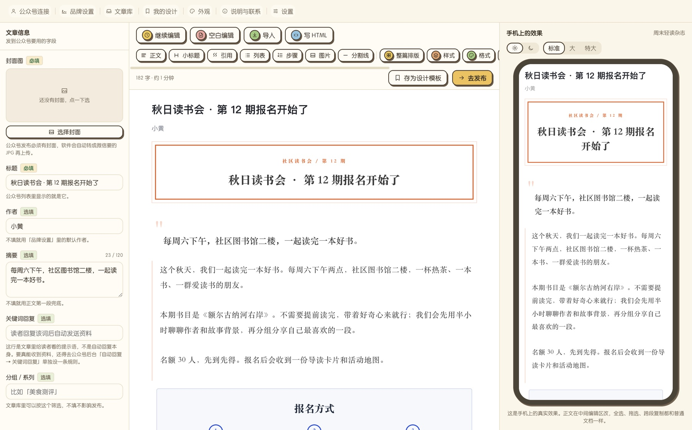
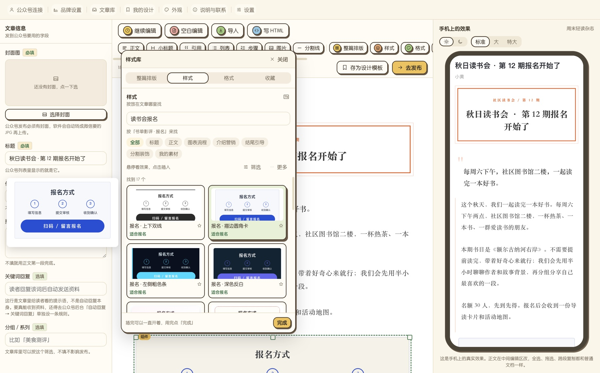

# 小黄内容助手

小黄内容助手（原名「小黄公众号助手」）是一款面向公众号运营者的文章排版与发布辅助工具。提供 Mac 版和 Windows 版。

它可以帮你导入文章、按模板排版、插入排版模块和装饰挂件、整理封面与正文图片、检查发布字段，并通过微信官方授权把文章保存到公众号草稿箱。

## 主要能力

- 导入 Markdown、TXT、HTML、DOCX、可复制文字的 PDF，也可以直接粘贴正文。
- 「整篇排版」：600 多套，按文章内容分类（资讯、知识、商业、生活、情感文化、教育、健康、政务、节日专题），鼠标停一下右边手机里就能看整篇效果；只换了颜色的合成一张卡，换色点就换颜色。
- 「样式」（原来的模块和挂件合在一起）：标题、正文、图表流程、介绍营销、结尾引导、分割装饰六大类，鼠标停一下就在旁边显示效果。
- 搜索听得懂意思：写「学校国庆放假通知」「奶茶店开业」「招人」都能找到合适的素材，每条结果写着为什么出现。
- 「我的素材」：自己存的、别处复制来的、整个文件夹导入的模板、模块和挂件，都能分类收好，点一下插进文章。
- 新素材由服务器下发，软件打开时自动更新，不用重装（Mac、Windows 都是）。
- 按块编辑：正文、小标题、引用、列表、表格、图片、排版模块、装饰挂件、HTML 自由块，每一块都能单独调样式。
- 扫码连接公众号（Mac 版）：走微信官方第三方平台授权，由公众号管理员扫码确认，不需要填写公众号的开发者密码。
- 发布前检查封面、摘要和公众号兼容性，再保存到公众号草稿箱（Mac 版）；没连公众号时，一键复制排好版的正文和发布字段，到公众号后台粘贴。
- Windows 版：编辑排版功能和 Mac 版一样，在各种屏幕上自动调整界面大小；还不能连接公众号，写好后复制到公众号后台粘贴发布，扫码连接、存进草稿箱正在开发。

## 界面

截图是 Windows 版（和 Mac 版同一套界面），里面是虚构的示例文章。

## 官方能力边界

小黄内容助手不会模拟登录微信公众号后台，不会绕过二维码、验证码、账号权限或微信风控。

授权规则以微信官方为准：只有公众号管理员扫码才能完成授权。最终预览、原创声明、合集、话题、赞赏、群发和定时发布等能力，以公众号后台和账号实际权限为准。

## 下载

当前版本：Mac、Windows `0.3.6`（2026-09-25）

- 国内下载（推荐）：<https://wx.xiaohuang365.com/download/>
- GitHub：[v0.3.6 Release](https://github.com/olikahn11/wechat-official-account-assistant-public/releases/tag/v0.3.6)（历史版本都在 [Releases](https://github.com/olikahn11/wechat-official-account-assistant-public/releases) 里）

两个地址的安装包完全一样。需要在 Windows 上直接连接公众号的，可以先继续用旧版 [Windows 0.2.1](https://github.com/olikahn11/wechat-official-account-assistant-public/releases/tag/v0.2.1)（旧版叫「小黄公众号助手」，只支持填写开发者接口连接），新旧两个版本互不影响。

详细安装步骤见 [DOWNLOAD.md](DOWNLOAD.md)。

## 使用

1. 安装并打开小黄内容助手。
2. 导入文章或粘贴正文。
3. 选一套模板，按需要插入模块、挂件，逐块调整。
4. 补上封面和正文图片。
5. 扫码连接公众号（第一次需要公众号管理员扫码）。
6. 运行发布前检查，保存到公众号草稿箱，再到公众号后台预览、群发。

Windows 版这一版还不能连接公众号：第 5、6 步改成在发布页点「复制正文」「复制发布字段」，到公众号后台新建文章粘贴，再预览、群发。

## 文档

- [下载与安装](DOWNLOAD.md)
- [更新日志](CHANGELOG.md)
- [常见问题](FAQ.md)
- [版权说明](COPYRIGHT.md)

本公开仓库不包含软件源码、开发配置或敏感信息。
