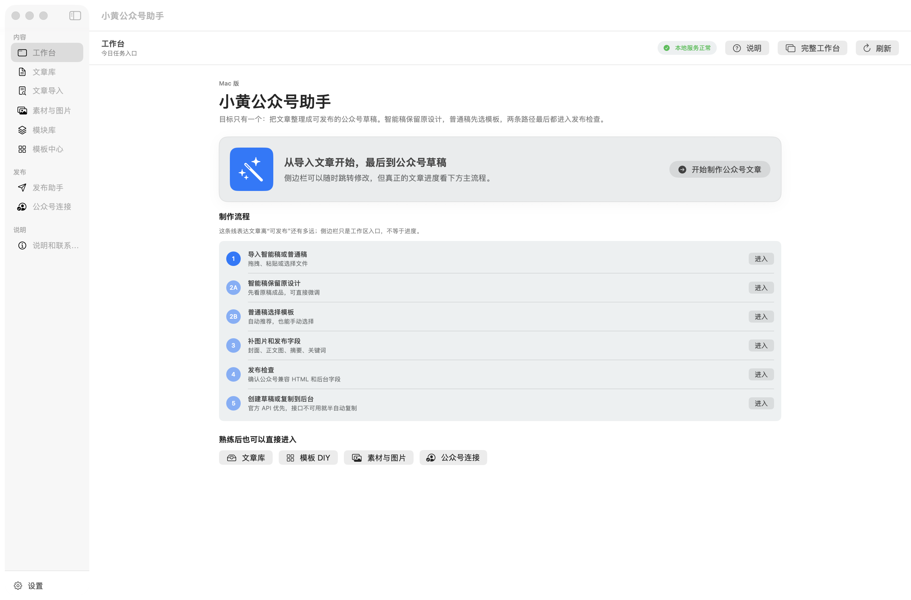

# 小黄公众号助手

小黄公众号助手是一款面向公众号运营者的文章生产与发布辅助工具，提供 Mac 与 Windows 客户端。

它可以帮助你导入文章、识别结构、选择模板、整理封面与正文图片、检查发布字段，并在公众号权限允许时通过微信官方 API 创建或更新草稿。

## 主要能力

- 导入 Markdown、TXT、HTML、DOCX、可复制文字的 PDF。
- 识别标题、作者、摘要、章节、图片占位和关键词回复。
- 提供公众号类型模板、自动推荐和公众号兼容 HTML。
- 管理封面、正文图片和常用发布方案。
- 使用微信官方 API 上传素材、创建或更新草稿。
- 接口不可用时提供复制正文、字段清单和人工操作提示。

## 官方能力边界

小黄公众号助手不会模拟登录微信公众号后台，不会绕过二维码、验证码、IP 白名单、账号权限或微信风控。

最终预览、原创声明、合集、话题、赞赏、群发和定时发布等能力，以公众号后台和账号实际权限为准。

## 下载

当前版本：`0.2.1`

请前往 [GitHub Releases](https://github.com/olikahn11/xiaohuang-wechat-assistant-public/releases/tag/v0.2.1) 下载 Mac 或 Windows 安装包。详细说明见 [DOWNLOAD.md](DOWNLOAD.md)。

## 使用

1. 安装并打开对应平台客户端。
2. 导入文章或粘贴正文。
3. 检查识别结果并选择模板。
4. 补充封面、图片和发布字段。
5. 运行发布检查。
6. 有公众号官方接口权限时创建草稿；否则复制兼容内容到公众号后台。

## 文档

- [下载与安装](DOWNLOAD.md)
- [更新日志](CHANGELOG.md)
- [常见问题](FAQ.md)
- [版权说明](COPYRIGHT.md)

本公开仓库不包含软件源码、开发配置或敏感信息。
